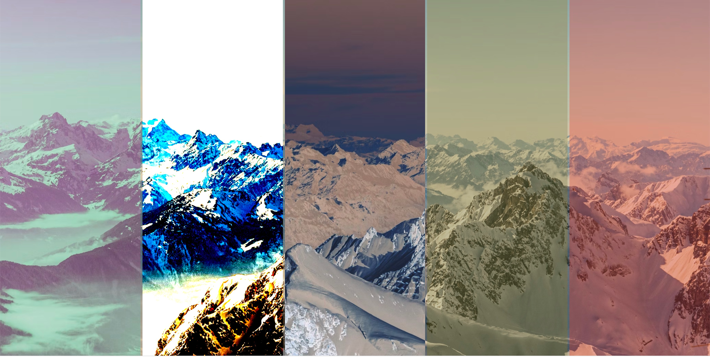
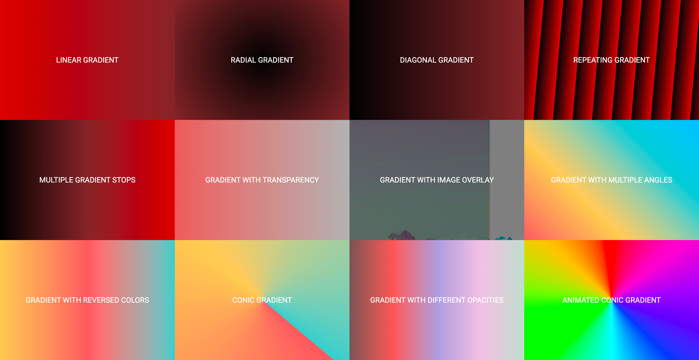

## Cool CSS Tricks and Tips :smiley:	

I have compiled a list of some cool stuff using css and the list goes below:

- Animated borders using SVG 
    
- Mixed Blending
  
- Conic Gradient 
  
- Gradient Border using SVG
- Grid View
- Image Inside Text
- Logical Props
- Spinner
- Triangle
- Typing Effect (it's working, but there is width issue work in progress)
- Smile
- Infinity Symbol
- Yin And Yang
- Filters and Backdropfilters

- CSS Gradients

 

I will keep adding more stuff stay tuned for cooler stuff. :smiley:	 

